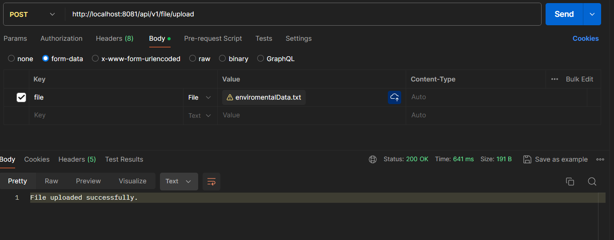
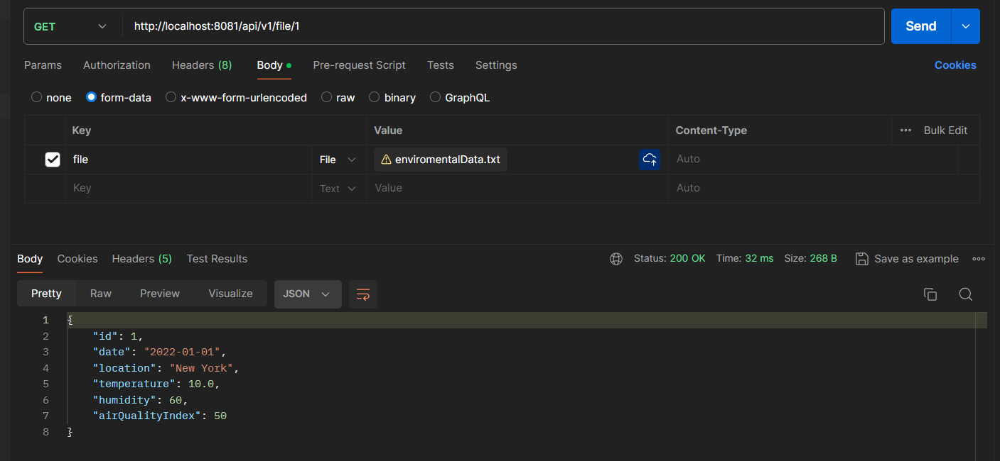
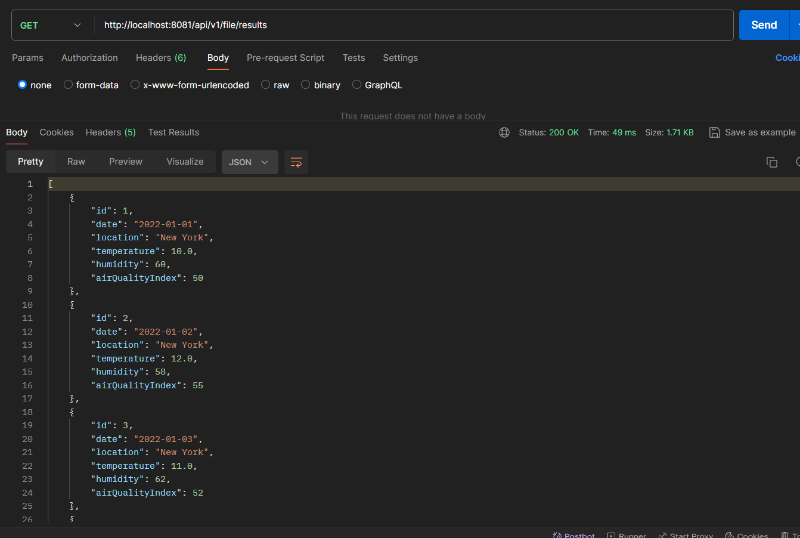
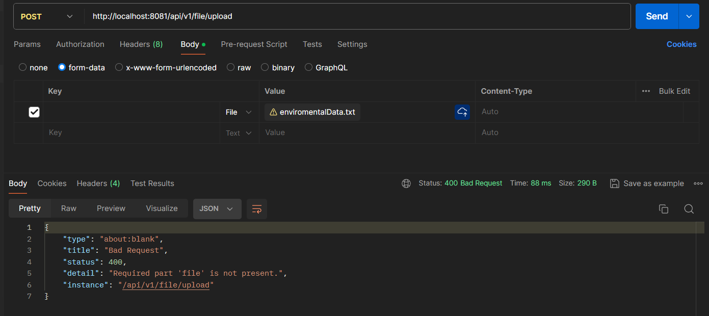
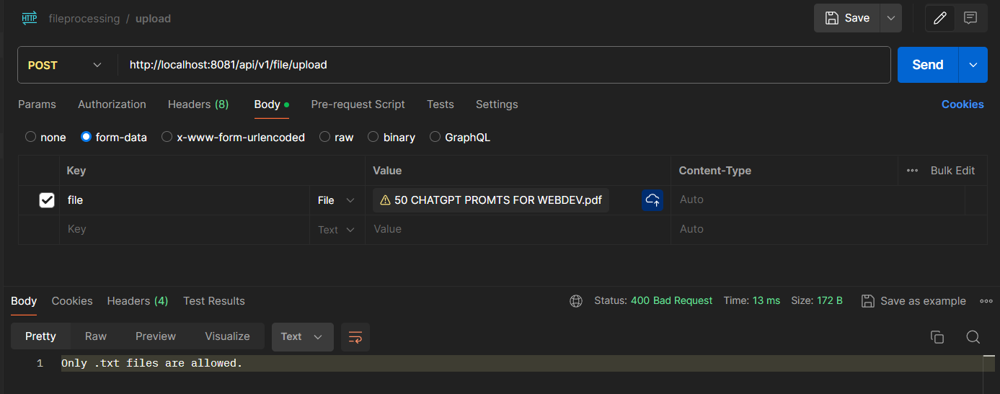
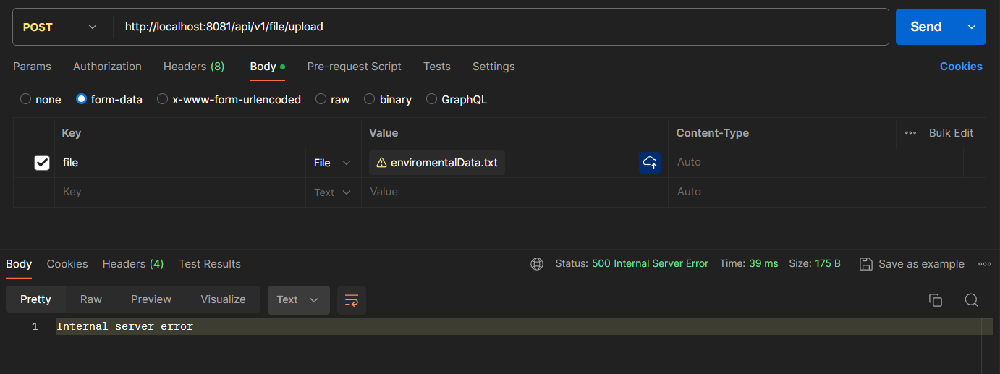
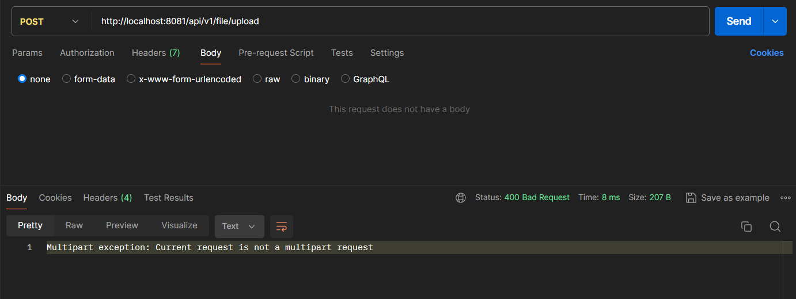
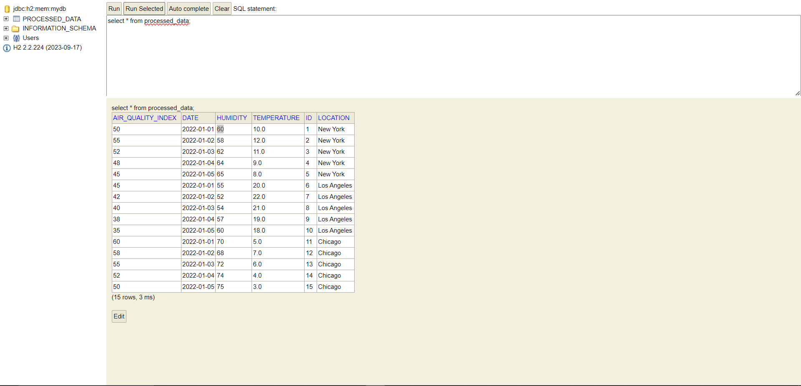

# File Data Processing API Documentation
The purpose of the program is to serve as a RESTful API designed to aid environmental consulting firm, Enviro365, in streamlining the processing of file-based environmental data for their clients. This API enables clients to upload text files containing environmental data, which are then analyzed and processed. Through simple API requests, clients can retrieve the processed results. The program also includes functionality to store the data in a database, ensuring efficient management and accessibility of environmental data for clients. Thus, the program's goal is to provide a convenient and effective solution for file data processing within the environmental consulting domain.

## Endpoints

### 1. `http://localhost:8081/api/v1/file/upload`
- **Method**: POST
- **Description**: Upload a file containing data entries to be processed.
- **Parameters**:
  - `file`: The file containing data entries (multipart/form-data)
- **Response**:
  - **Status Code**: 200 OK
  - **Body**: JSON object confirming successful upload.

    

### 2. `http://localhost:8081/api/v1/file/1`
- **Method**: GET
- **Description**: Retrieve data by id.
- **Parameters**:
    - None
- **Response**:
    - **Status Code**: 200 OK
    - **Body**: JSON array containing processed data entries.

### 3. `http://localhost:8081/api/v1/file/results`
- **Method**: GET
- **Description**: Retrieve all processed data entries.
- **Parameters**:
  - Nonee
- **Response**:
  - **Status Code**: 200 OK
  - **Body**:  JSON array containing all processed data entries.

    

## Error Handling Procedures

- **HTTP Status Codes**:
    - 400 Bad Request: Invalid request parameters or format.
    - 404 Not Found: Endpoint not found.
    - 500 Internal Server Error: Unexpected server error.
- **Error Response Format**:

  
- 
- 
- 
  

  

  

  

## H2 Data Table

## Tech Stack
- Java >= 17
- Maven
- spring boot
- H2 Data Base

To run the program successfully, please upload the file enviromentalData.txt located in the following directory: task/testData/.

This file contains the environmental data entries needed for processing.